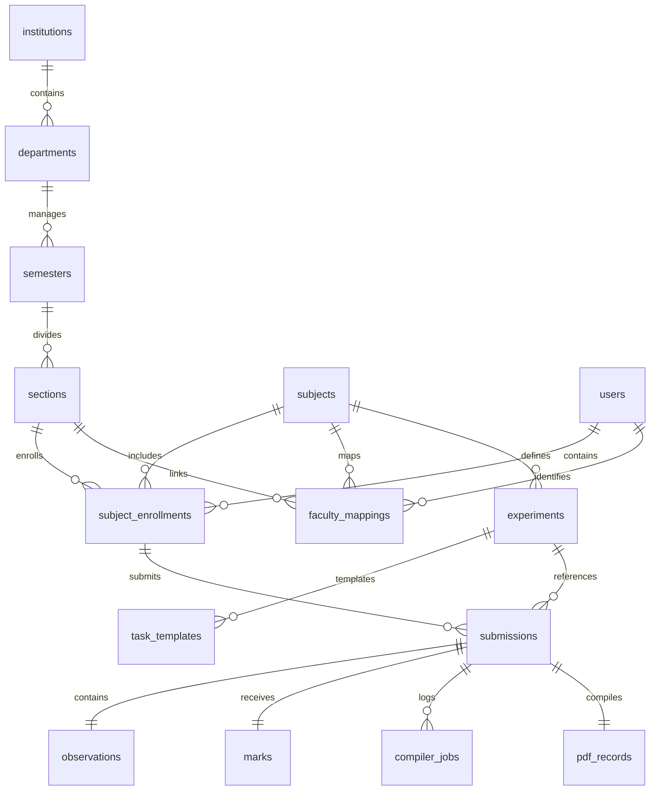

# LabCode — Database Architecture & Data Modeling Specification (Phase 3.3)
## PostgreSQL (Supabase) Database Schema & Data Dictionary Specification

---

## 1. Database Overview

### 1.1 Purpose & Responsibilities
The data layer is built on a **PostgreSQL** relational database hosted on **Supabase**. The database acts as the single source of truth, storing user profiles, academic courses, laboratory tasks, compilation logs, grades, and student records.

```
       +---------------------------------------------+
       |             Supabase Platform               |
       |  +---------------------------------------+  |
       |  |            PostgreSQL Core            |  |
       |  |  +---------------------------------+  |  |
       |  |  |     Relational Schemas (3NF)    |  |  |
       |  |  +---------------------------------+  |  |
       |  |  +---------------------------------+  |  |
       |  |  |   Row-Level Security (RLS) Rules|  |  |
       |  |  +---------------------------------+  |  |
       |  +---------------------------------------+  |
       +---------------------------------------------+
```

### 1.2 Database Architecture Goals & Guiding Principles
*   **Data Integrity:** Enforces relational integrity using foreign key constraints and validation checks.
*   **Access Security:** Secures tables using Supabase Row-Level Security (RLS) rules based on user roles.
*   **Query Performance:** Employs targeted indexes on foreign keys and search columns to keep query latencies under 100ms.
*   **Future SaaS Scaling:** Includes tenant and campus identifiers in the schema, allowing future multi-college upgrades with minimal restructuring.

---

## 2. Data Modeling Philosophy

The schema design follows these core database modeling standards:

*   **Normalization Level:** Designed in **Third Normal Form (3NF)** to minimize data redundancy and prevent update anomalies.
*   **Naming Conventions:** All table and column names use `snake_case` (e.g., `student_profiles`, `submitted_at`).
*   **Primary Key (PK) Strategy:** Employs auto-incrementing integers (`bigserial`) for transaction tables, and alphanumeric strings for identifiers (e.g., USNs for student profiles).
*   **Foreign Key (FK) Strategy:** Every relationship is mapped with explicit foreign key constraints, using prefix naming conventions (e.g., `fk_submissions_users`).
*   **Soft Deletions:** Deletion actions set a `deleted_at` timestamp. Records with active values are excluded from default queries, preventing accidental data loss.
*   **Timestamp Standardization:** All date and time entries use the `timestamp with time zone` (TIMESTAMPTZ) format to ensure consistent audit tracking.

---

## 3. Entity Catalogue

The database consists of the following core entities:

```
+-----------------------------------------------------------------------------+
|                           LABCODE DATABASE ENTITIES                         |
+-----------------------------------------------------------------------------+
|  1. institutions         |  8. task_templates       | 15. marks             |
|  2. departments          |  9. users                | 16. session_attendances|
|  3. semesters            | 10. roles                | 17. compiler_jobs     |
|  4. sections             | 11. subject_enrollments  | 18. pdf_records       |
|  5. subjects             | 12. lab_sessions         | 19. notifications     |
|  6. faculty_mappings     | 13. submissions          | 20. system_audit_logs |
|  7. experiments          | 14. observations         | 21. app_settings      |
+-----------------------------------------------------------------------------+
```

1.  **institutions:** Represents colleges mapped in the system (holds MITE metadata).
2.  **departments:** Academic departments (e.g., Computer Science & Engineering).
3.  **semesters:** Academic terms (e.g., 3rd Year, Semester 5).
4.  **sections:** Section divisions within semesters (e.g., Section A, Section B).
5.  **subjects:** Courses containing lab sessions (e.g., Data Structures Lab).
6.  **faculty_mappings:** Maps faculty members to the subjects and sections they teach.
7.  **experiments:** Programming exercises assigned to subjects.
8.  **task_templates:** Boilerplate code configurations for compilation tasks.
9.  **users:** Core user records containing login details and role identifiers.
10. **roles:** System roles (Student, Faculty, Administrator).
11. **subject_enrollments:** Maps student users to sections and subjects.
12. **lab_sessions:** Log details of active laboratory sessions.
13. **submissions:** Student source code submissions.
14. **observations:** Student qualitative descriptions and execution logs.
15. **marks:** Numerical grades assigned to student submissions.
16. **session_attendances:** Logs student presence during laboratory sessions.
17. **compiler_jobs:** Sandbox logs recording compilation events.
18. **pdf_records:** Compiled PDF lab records stamped with faculty signatures.
19. **notifications:** System alerts and proctoring warnings.
20. **system_audit_logs:** Activity logs tracking administrative actions.
21. **app_settings:** System configurations (e.g., session heartbeat timeouts).

---

## 4. Entity Relationship (ER) Model

The diagram below defines the relational hierarchy and cardinality rules of the system:



---

## 5. Attribute Specifications (Data Dictionary)

### 5.1 `users` Table
*   **Purpose:** Stores user profiles and credentials.
*   **Attributes:**

| Column Name | Data Type | Nullable | Default Value | Validation Rules | Business Meaning | Sensitivity |
| :--- | :--- | :---: | :--- | :--- | :--- | :--- |
| `id` | UUID | No | `gen_random_uuid()` | Primary Key | User ID | Public |
| `username` | VARCHAR(50)| No | None | Unique, lowercase | Login ID (e.g., USN) | PII |
| `password_hash`| VARCHAR(255)| No | None | Bcrypt format hash | Secure login password | Confidential|
| `role_id` | INT | No | None | Foreign Key | User role mapping | Internal |
| `name` | VARCHAR(100)| No | None | Min 3 characters | Full user name | PII |
| `blocked_until`| TIMESTAMPTZ| Yes | NULL | Must be future date | Faculty-imposed lockout | Internal |
| `deleted_at` | TIMESTAMPTZ| Yes | NULL | Must be future date | Soft delete marker | Internal |

---

### 5.2 `submissions` Table
*   **Purpose:** Logs student code submissions.
*   **Attributes:**

| Column Name | Data Type | Nullable | Default Value | Validation Rules | Business Meaning | Sensitivity |
| :--- | :--- | :---: | :--- | :--- | :--- | :--- |
| `id` | BIGINT | No | Next Serial | Primary Key | Submission record ID | Internal |
| `enrollment_id`| BIGINT | No | None | Foreign Key | Mapped student ID | Internal |
| `experiment_id`| BIGINT | No | None | Foreign Key | Mapped task ID | Internal |
| `language` | VARCHAR(20) | No | None | Allowed options list | Coding language used | Internal |
| `source_code` | TEXT | No | None | Minimum 5 characters | Code input | Internal |
| `submitted_at` | TIMESTAMPTZ| No | `now()` | Standard timestamp | Time code was saved | Internal |

---

### 5.3 `marks` Table
*   **Purpose:** Stores grades assigned by faculty.
*   **Attributes:**

| Column Name | Data Type | Nullable | Default Value | Validation Rules | Business Meaning | Sensitivity |
| :--- | :--- | :---: | :--- | :--- | :--- | :--- |
| `id` | BIGINT | No | Next Serial | Primary Key | Grading ID | Internal |
| `submission_id`| BIGINT | No | None | Foreign Key, Unique | Linked submission | Internal |
| `evaluator_id` | UUID | No | None | Foreign Key | Faculty ID | Internal |
| `grade_score` | INT | No | None | Range 0 to 10 | Numerical grade | Confidential|
| `remarks` | TEXT | Yes | NULL | Optional text | Faculty feedback | Confidential|
| `graded_at` | TIMESTAMPTZ| No | `now()` | Standard timestamp | Time grade was saved | Internal |

---

## 6. Relationship Rules & Constraints

To maintain referential integrity, foreign key relations use the following delete and update constraints:

| Relationship Name | Parent Table | Child Table | Delete Behavior | Update Behavior |
| :--- | :--- | :--- | :--- | :--- |
| `fk_users_roles` | `roles` | `users` | RESTRICT | CASCADE |
| `fk_enrollments_sections`| `sections` | `subject_enrollments`| RESTRICT | CASCADE |
| `fk_submissions_enroll` | `subject_enrollments`| `submissions` | RESTRICT | CASCADE |
| `fk_submissions_tasks` | `experiments` | `submissions` | RESTRICT | CASCADE |
| `fk_marks_submissions` | `submissions` | `marks` | CASCADE | CASCADE |
| `fk_observations_subs` | `submissions` | `observations` | CASCADE | CASCADE |

*   **RESTRICT Rules:** Prevents deletion of core configurations (e.g., sections, user accounts) if dependent transactions (e.g., student enrollments, submissions) exist.
*   **CASCADE Rules:** Automatically deletes dependent details (e.g., marks, observations) if the parent record (e.g., a submission) is removed.

---

## 7. Normalization & Verification

The database schema is designed to meet Third Normal Form (3NF) requirements to ensure data consistency:

*   **First Normal Form (1NF):** Every column contains only atomic, single-valued attributes. List columns (e.g., multi-language choices) are normalized into related tables.
*   **Second Normal Form (2NF):** The schema meets 1NF, and all non-key attributes depend entirely on the primary key, eliminating partial dependencies.
*   **Third Normal Form (3NF):** The schema meets 2NF, and all attributes depend directly on the primary key without transitive dependencies.
*   **Intentional Denormalization:** The system uses cached compilation logs in the `submissions` table. This avoids running complex joins on the `compiler_jobs` table during real-time student updates, improving dashboard response speeds.

---

## 8. Data Integrity Rules

*   **Unique Constraints:**
    *   `users.username` must be unique to prevent duplicate student or faculty login credentials.
    *   `subject_enrollments` must maintain unique constraints on the combination of `(user_id, subject_id, section_id)` to prevent duplicate registrations.
*   **Check Constraints:**
    *   `marks.grade_score` is restricted to integer values between `0` and `10` via a validation check constraint (`CHECK (grade_score >= 0 AND grade_score <= 10)`).
    *   `experiments.program_id` must use lowercase alphanumeric codes with underscores (regex verification: `CHECK (program_id ~ '^[a-z0-9_]+$')`).

---

## 9. Indexing Strategy

To keep query response times under 100ms, the schema includes the following indexes:

| Table Target | Index Name | Index Columns | Type | Purpose |
| :--- | :--- | :--- | :--- | :--- |
| `users` | `idx_users_username` | `username` | B-Tree | Speeds up login lookups. |
| `subject_enrollments`| `idx_enrollments_lookup`| `user_id`, `subject_id` | B-Tree | Optimizes student course searches. |
| `submissions` | `idx_subs_lookup` | `enrollment_id`, `experiment_id`| B-Tree | Speeds up task submission queries. |
| `submissions` | `idx_subs_submitted` | `submitted_at DESC` | B-Tree | Optimizes sorting for recent submissions. |
| `compiler_jobs` | `idx_jobs_sub` | `submission_id` | B-Tree | Speeds up console output history queries.|
| `system_audit_logs` | `idx_audit_created` | `created_at DESC` | B-Tree | Speeds up search filtering for system audits.|

---

## 10. Audit Strategy

The database tracks data changes using standardized audit attributes:

*   **Audit Fields:** Every transactional table includes metadata columns:
    *   `created_by` (UUID referencing user ID)
    *   `created_at` (TIMESTAMPTZ defaulting to current time)
    *   `updated_by` (UUID referencing user ID)
    *   `updated_at` (TIMESTAMPTZ updated via triggers)
    *   `deleted_at` (TIMESTAMPTZ setting the soft delete marker)
*   **Soft Delete Policy:** When a soft delete is triggered, the `deleted_at` timestamp is updated. System queries exclude records with active `deleted_at` values, preserving data for recovery if needed.

---

## 11. Security, Privacy & Data Classification

To protect personal and institutional details, data is classified into the following security tiers:

| Tier Classification | Target Data Columns | Access Restrictions | Encryption Requirement |
| :--- | :--- | :--- | :--- |
| **Public** | `subjects.code`, `subjects.name` | Readable by all validated user sessions. | Standard TLS transit security |
| **PII (Personal)** | `users.name`, `users.username` | Accessible only by administrators and the user. | TLS transit security |
| **Confidential** | `users.password_hash` | Write-only for users; read access restricted. | Blowfish hash hashing (Bcrypt) |
| **Sensitive** | `marks.grade_score`, `marks.remarks` | Readable by faculty and the student; writable only by faculty. | TLS transit & storage encryption |

---

## 12. Data Lifecycle Management

```
[Account Creation] -> [Subject Enrollment] -> [Session Heartbeat]
                                                    |
                                                    v
[Grade signed & locked] <- [Final Submission] <- [Draft compiles run]
         |
         v
[System Audit Log] -> [Soft Delete Archive] -> [Point In Time Recovery Backup]
```

1.  **Creation:** Student accounts and subject enrollments are created by system administrators.
2.  **Modification:** Students save code drafts and update observations during active lab sessions.
3.  **Submission:** The student submits their final code, which locks the editor to prevent edits.
4.  **Evaluation:** Faculty review the submission, assign a grade, and apply their signature stamp.
5.  **Archival:** Completed laboratory records are compiled into signed PDFs and archived for compliance checks.

---

## 13. Database Performance Strategy

*   **Partitioning Logs:** The `compiler_jobs` table is partitioned by month to keep query performance fast as log data grows.
*   **Cursor-Based Pagination:** Database queries for large log tables use cursor-based pagination, avoiding high offset loads on the database.
*   **JSON Serialization:** Student observations and compiler run logs are stored in text columns to prevent deep table joins during retrievals.

---

## 14. Future Expandability Specs

*   **Multi-Institution Support:** The database contains an `institutions` table. All departments, subjects, and users reference an `institution_id` foreign key, allowing future multi-college deployments with minimal restructuring.
*   **Versioned Experiments:** The `experiments` table includes a `version_number` column. This allows faculty to update assignments while preserving older versions linked to past student records.

---

## 15. Database Risks & Mitigation

*   **Large Table Growth:** The `compiler_jobs` table logs multiple compile runs per student, which can slow down queries over time.
    *   *Mitigation:* Partition log tables by month and run automated archival tasks to clean up logs older than 90 days.
*   **Transaction Deadlocks:** Concurrent updates to student progress records during exams can cause transaction deadlocks.
    *   *Mitigation:* Keep transactions short and use explicit, ordered indexes to lock records consistently.

---

## 16. Database Naming Standards

To maintain consistency, schema configurations follow these naming conventions:

*   **Table Names:** Plural nouns using snake_case (e.g., `faculty_mappings`, `system_audit_logs`).
*   **Primary Keys:** Named `id` across all tables for consistent joins.
*   **Foreign Keys:** Formatted as `fk_<child_table>_<parent_table>` (e.g., `fk_submissions_experiments`).
*   **Indexes:** Formatted as `idx_<table_name>_<columns>` (e.g., `idx_users_username`).

---

## 17. Backup & Recovery Considerations

*   **Logical Backups:** Supabase runs daily logical schema backups, storing them in encrypted off-site storage.
*   **Point-in-Time Recovery (PITR):** The database enables PITR logs to support database state restoration within a 1-second recovery window.
*   **Disaster Recovery:** Databases are replicated to backup server regions to ensure quick recovery if a primary server fails.

---

## 18. Database Developer Guidelines

*   **DO:** Define explicit foreign key constraints for all relationships.
*   **DO:** Add index triggers to all foreign keys to speed up join queries.
*   **DON'T:** Do not use raw database triggers to calculate grades; keep business logic in the application layers.
*   **DON'T:** Do not run queries without limit constraints on log tables.

---

## 19. Architecture Review & Assessment

*   **Verified Database Keys:** Confirm that user logins and mapped session tokens align with database schema constraints.
*   **RLS Security Configuration:** Row-Level Security rules are enabled on all tables, ensuring users can access only their authorized records.
*   **Schema Normalization:** Verified 3NF database design to prevent update anomalies.

---

## 20. Database Readiness Checklist

*   [x] PostgreSQL database tables mapped to academic entity requirements.
*   [x] Row-level security rules configured for all tables.
*   [x] Database indexes created for key lookup columns and foreign keys.
*   [x] Check constraints defined for grading scores and inputs.
*   [x] Schema structured to support future multi-college expansions.
