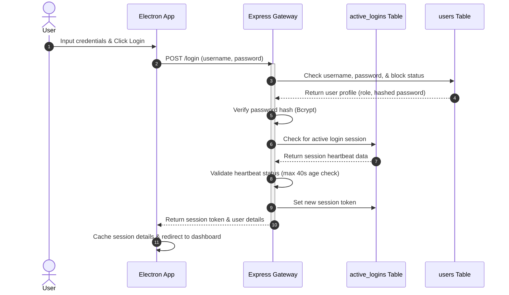
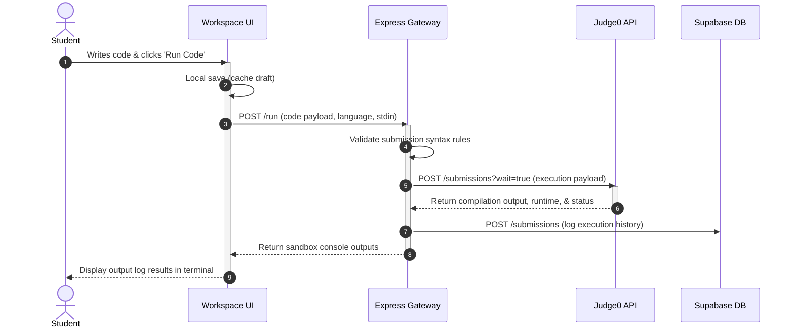

# LabCode — Enterprise Technical Architecture & Engineering Specification (Phase 3.4)
## System Integration, Security, Infrastructure, and Handoff Specification

---

## 1. API Architecture

LabCode's API is designed as a stateless, RESTful service.

*   **API Philosophy:** Simple, stateless, and resource-oriented.
*   **REST Standards:** Exposes resources using JSON and maps actions to standard HTTP methods.
*   **Versioning:** Versioning is handled via URL prefixes (e.g., `/api/v1/...`).
*   **Resource Naming:** Uses plural nouns for resource paths (e.g., `/api/v1/submissions`).
*   **HTTP Methods:**
    *   `GET`: Retrieve resources.
    *   `POST`: Create new resources.
    *   `PATCH`: Modify existing resources.
    *   `DELETE`: Soft-delete target records.
*   **Status Codes:** Standard HTTP status codes are used to indicate request results:
    *   `200 OK`: Successful retrieval or update.
    *   `201 Created`: Successful creation.
    *   `400 Bad Request`: Validation failure.
    *   `401 Unauthorized`: Authentication missing or invalid.
    *   `403 Forbidden`: Role permission restriction.
    *   `404 Not Found`: Resource does not exist.
    *   `500 Internal Error`: Server execution failure.
*   **Query Parameters:**
    *   *Pagination:* Uses `page` and `limit` parameters (e.g., `?page=2&limit=20`).
    *   *Sorting:* Formatted as `?sort=column:direction` (e.g., `?sort=submitted_at:desc`).
    *   *Filtering:* Direct parameter matches (e.g., `?subject_id=12`).

---

## 2. API Design Principles

The API enforces standardized request and response structures to simplify integration:

### 2.1 Request & Response Formats
*   **Success Response Structure:**
```json
{
  "success": true,
  "data": { ... },
  "metadata": {
    "timestamp": "2026-07-20T01:48:31Z",
    "requestId": "req_uuid_12345"
  }
}
```
*   **Error Response Structure:**
```json
{
  "success": false,
  "error": {
    "code": "ERR_VALIDATION_FAILED",
    "message": "The provided USN format is invalid.",
    "details": [
      { "field": "username", "issue": "Must match MITE USN regex pattern." }
    ]
  },
  "metadata": {
    "timestamp": "2026-07-20T01:48:31Z",
    "requestId": "req_uuid_12346"
  }
}
```
*   **Timestamp standard:** All API timestamps must use the ISO-8601 UTC format (`YYYY-MM-DDTHH:mm:ssZ`).

---

## 3. API Module Organization

The API is divided into logical modules to isolate database queries and backend processing:

*   **Auth Module:** Manages user login, session heartbeats, logout, and token validation.
*   **User Directory:** Manages administrator tasks for student, faculty, and administrative profiles.
*   **Academic Structure:** Manages configurations for departments, sections, cycle divisions, and subjects.
*   **Syllabus & Tasks:** Manages experiments and boilerplate templates for specific subjects.
*   **Compiler Interface:** Proxies source code execution payloads directly to the sandboxed compile environment.
*   **Submissions & Logs:** Logs student code submissions, stdout/stderr history, and status updates.
*   **Grades & Comments:** Saves scores and feedback notes entered by faculty.
*   **PDF Compiler:** Generates student performance reports and stamps signatures on compiled PDFs.
*   **Notifications:** Logs proctoring violations and exits from fullscreen mode.

---

## 4. Authentication Architecture

The authentication system manages secure logins, active sessions, and logout cleanups.



*   **Session Heartbeat:** Students run a background heartbeat task every 15 seconds. If the session is removed or modified, the student is logged out.
*   **Double-Login Lock:** The system blocks concurrent logins for the same USN if the active session heartbeat was updated within the last 40 seconds.
*   **Post-Exam Lockout:** Faculty can set lockout timers that block user logins for a section once an exam ends.

---

## 5. Authorization

The platform uses Role-Based Access Control (RBAC) to enforce security rules across the system.

```
       +-----------------------------------------------------+
       |                  Admin Role Permissions             |
       |  - Manage users, sections, departments, subjects    |
       |  - Read-only access to submissions and system logs |
       +-----------------------------------------------------+
                                 |
                                 v
       +-----------------------------------------------------+
       |                  Faculty Role Permissions           |
       |  - Manage lab tasks and experiments                 |
       |  - Read, grade, and sign student submissions        |
       |  - Toggle proctoring controls and session locks      |
       +-----------------------------------------------------+
                                 |
                                 v
       +-----------------------------------------------------+
       |                  Student Role Permissions           |
       |  - Read assigned tasks                              |
       |  - Compile code drafts and log observations         |
       |  - Submit solutions and download graded PDFs        |
       +-----------------------------------------------------+
```

### 5.1 Authorization Matrix

| System Module | Student | Faculty | Admin |
| :--- | :---: | :---: | :---: |
| **Manage Users** | Denied | Denied | Full Control (C/R/U/D) |
| **Manage Courses** | Denied | Denied | Full Control (C/R/U/D) |
| **Create Lab Tasks** | Denied | Full Control (C/R/U/D) | Denied |
| **Toggle Security Controls** | Denied | Full Control (U/D) | Denied |
| **Enter Grades & Remarks** | Denied | Full Control (U/D) | Denied |
| **View Submissions** | Read Self | Full Control (R) | Read Only |
| **Download PDF Reports** | Single PDF | Bulk PDF Compile | Denied |

---

## 6. Security Architecture

To protect system integrity, the platform enforces the following security controls:

*   **Row-Level Security (RLS):** Supabase database tables restrict data access based on user role variables in authentication headers.
*   **Rate Limiting:** The Express gateway limits compiler run requests to 10 submissions per minute per USN to prevent resource abuse.
*   **Clipboard Restrictions:** Paste events are blocked inside the editor when paste restrictions are enabled.
*   **Electron Sandboxing:** Configures `sandbox: true` and `contextIsolation: true` in the browser window to isolate the Renderer process from Node.js APIs.
*   **Input Sanitization:** Sanitizes code and form inputs to prevent SQL injection and cross-site scripting (XSS) attacks.
*   **Signature Security:** Stored faculty signatures are PIN-protected locally in the browser to prevent unauthorized access.

---

## 7. Sandbox Execution Architecture

The system compiles and runs student code drafts in a secure sandbox:

```
[Student Run Code] 
      |
      v
[Express Sandbox Proxy] ---> Validate input format ---> [Judge0 Cloud API]
                                                               |
                                                               v
[Console Output Display] <--- Log run statistics <--- Return execution output
```

*   **Execution Sandbox:** Compilation tasks are forwarded to the Judge0 API (`https://ce.judge0.com/submissions?wait=true`).
*   **Resource Limits:** Exceeding these limits terminates the compile run and returns an error:
    *   *CPU Time Limit:* 5 seconds maximum run time.
    *   *Memory Limit:* 256 MB maximum memory usage.
*   **Input Handling:** Supports custom `stdin` inputs to test code against different scenarios.
*   **Status Codes:** Maps sandbox results to clean tags (e.g., *Passed*, *Compile Error*, *Runtime Error*).

---

## 8. Compiler Execution Workflow

The diagram below details the step-by-step flow from writing code to retrieving sandbox results:



---

## 9. File Management Architecture

*   **Temporary File System:** PDF generation takes place in memory using buffers. No student records or temporary files are saved to the server's disk.
*   **Document Naming Standard:** Exported files use a standardized naming convention:
    *   *Single PDF:* `LabRecord_[USN]_[SubjectCode].pdf`
    *   *Bulk PDF:* `LabRecord_Class_[SubjectCode]_[Section].pdf`
*   **File Cleanup:** Browser session storage and signature templates are cleared immediately when the user signs out.

---

## 10. PDF Generation Architecture

The PDF generation module converts graded submissions into formatted lab records:

```
[Generate PDF Request]
         |
         v
[Initialize pdfkit Document]
         |
         v
[Compile Header Layout (Logo, USN, Course metadata)]
         |
         v
[Add Signature Stamp (PNG from request payload)]
         |
         v
[Flow Submissions (Code, run output, observations)]
         |
         v
[Stream PDF Buffer directly to Client response]
```

*   **Branding Layout:** The cover page displays the MITE logo, student details, course metadata, and grades.
*   **Signature Stamping:** Renders the faculty signature image directly onto the grade panel block.
*   **Multi-Page Formatting:** Formats code listings and observations cleanly, splitting content logically across pages.

---

## 11. Deployment Architecture

LabCode uses a distributed architecture to isolate system layers:

*   **Frontend (Electron App):** Distributed as packaged desktop installers (e.g., MSI or EXE) compiled using Electron Builder.
*   **Express Services:** Deployed to a Render web service configuration using containerized setups.
*   **Database (Supabase):** Deployed to PostgreSQL instances on Supabase Cloud.
*   **Development Configuration:** Runs local Electron instances connecting to development database branches and sandbox hosts.
*   **Production Configuration:** Pakaged application builds connecting to production database endpoints and secure API channels.

---

## 12. Infrastructure Specifications

*   **Load Balancing:** The backend service is set up for load balancing to handle traffic spikes during exam sessions.
*   **Monitoring:** Enforces periodic uptime checks for both database endpoints and the Judge0 sandbox compiler.
*   **Backup Strategy:** Daily database backups are kept in secure off-site storage to support point-in-time recovery.

---

## 13. Configuration Management

*   **Environment Variables:** Configures API keys, database connection strings, and endpoints using `.env` files.
*   **Development Configuration:** Enables debugger logs, test endpoints, and hot reloading.
*   **Production Configuration:** Disables console logs, minimizes JS bundles, and secures endpoint configurations.

---

## 14. Logging Specification

*   **Logging Tiers:**
    *   *Security Logs:* Tracks login failures, proctoring warnings, and session locks.
    *   *Audit Logs:* Logs administrative actions, grading changes, and user updates.
    *   *Error Logs:* Records backend errors and sandbox compilation failures.
*   **Retention:** Logs are kept for 90 days before being archived automatically.

---

## 15. System Monitoring

*   **Uptime Monitoring:** Periodically checks server health, database response times, and Judge0 availability.
*   **Dashboard Alerts:** Flags database connection failures or compiler drops immediately on the faculty dashboard.

---

## 16. Error Handling Strategy

*   **API Errors:** Standardizes error payloads using clean codes (e.g., `ERR_VALIDATION_FAILED`) and descriptions.
*   **Sandbox Fallback:** If the primary sandbox compiler goes offline, the system routes tasks to a backup compiler server.
*   **Session Recovery:** Expired sessions automatically redirect users to the login screen, clearing active tokens from the database.

---

## 17. Performance Targets

To maintain a fast, responsive interface, the system targets the following performance metrics:

*   **UI Load Speed:** Login and dashboard initialization must complete in under 2 seconds.
*   **Editor Loading:** The coding editor view must load and be ready for input within 3 seconds.
*   **Compiler Latency:** Code compilation runs and sandbox returns must complete in under 5 seconds.
*   **Autosave Confirmation:** Visual indicators must confirm autosaves in the editor header within 1 second of edits.
*   **PDF Export Speed:** Single PDF compilation must take under 4 seconds, and bulk class PDFs must compile in under 15 seconds.

---

## 18. Testing Architecture

*   **Unit Testing:** Verifies helper functions, input validation rules, and permission checks.
*   **Integration Testing:** Verifies data flows between the React Renderer and the Electron Main process.
*   **End-to-End (E2E) Testing:** Runs simulated workflows (e.g., student coding, compile runs, grading) using Playwright.
*   **Coverage Target:** Targets a minimum of 80% test coverage across core feature files.

---

## 19. Coding Standards

*   **File Naming:** React component files must use PascalCase (e.g., `SidebarMenu.tsx`). Hooks, utilities, and services must use camelCase (e.g., `useAutosave.ts`).
*   **Clean Imports:** Excludes relative import paths, using absolute aliases (e.g., `@/components/Button`) to keep imports clean.
*   **Strict Types:** Disallows the use of the `any` type in TypeScript declarations to maintain type safety.

---

## 20. Project Structure

The project uses the following directory structure:

```
labcode-workspace/
├── electron-app/               # Electron desktop app code (Frontend)
│   ├── src/                    # React Renderer source files
│   ├── package.json            # Electron packaging configuration
│   └── vite.config.ts          # Vite build configurations
├── backend-service/            # Node.js Express API code (Backend)
│   ├── src/                    # Express routing, services, and engines
│   └── package.json            # Node backend configuration
├── database/                   # Schema modeling configurations (Database)
│   ├── RLS_Policies.md         # Documentation for security policies
│   └── DB_Schema.md            # Schema references
└── documentation/              # Architecture and design specifications
```

---

## 21. CI/CD Pipeline Strategy

```
[Git Commit Code] 
      |
      v
[Run Unit & Integration Tests]
      |
      v
[Build Production Assets (Vite)]
      |
      v
[Package Electron Installers (EXE/MSI)]
      |
      v
[Release Build to Production Registry]
```

*   **Code Verification:** Automatically runs unit tests and code checks on every pull request.
*   **Production Build:** Compiles React assets using Vite, packages Electron installers using Electron Builder, and deploys the backend container to Render.

---

## 22. Implementation Roadmap

```
Phase 1: Setup & Core Auth (Weeks 1-2)
  ├── Initialize Electron, React, & Express repositories
  └── Build login verification, token checks, & session locks

Phase 2: Student Editor & Compilers (Weeks 3-4)
  ├── Implement split-pane workspace, editor, and console
  └── Connect sandbox compilation and observations forms

Phase 3: Faculty Dashboard & Grading (Weeks 5-6)
  ├── Build seating grids and real-time status monitors
  └── Implement grading controls and signature uploads

Phase 4: Admin Controls & Audits (Week 7)
  ├── Build department, course, and section config panels
  └── Develop user registries and system audit log views

Phase 5: Reports, Testing, & Launch (Week 8)
  ├── Connect PDF record compilation and bulk exports
  └── Run E2E testing, security reviews, and deploy to MITE
```

---

## 23. Technical Risks & Mitigations

*   **Sandbox Compiler Downtime:** The primary sandbox compiler may experience outages during lab sessions.
    *   *Mitigation:* Keep a backup sandbox service configured to handle compilations if the primary server goes offline.
*   **Offline Data Loss:** If the network disconnects, student code changes could be lost.
    *   *Mitigation:* Auto-save active code drafts in local browser storage, and sync them back to the database once connection is restored.
*   **Proctoring Bypasses:** Browser-based proctoring controls can be bypassed by advanced users.
    *   *Mitigation:* Use physical invigilation in the laboratory alongside digital window tracking indicators.

---

## 24. Architecture Review & Design Critiques

*   **Verified Database Keys:** Confirm that user logins and mapped session tokens align with database schema constraints.
*   **Decoupled Modules:** The architecture keeps the frontend interface, Express gateway, and database separate. This allows components to be updated or scaled independently.
*   **Client-Side Signature Security:** Caching signature images locally in the browser's storage keeps files secure but requires faculty to re-upload signatures if they switch terminals.

---

## 25. Final Implementation Readiness

*   **Maturity Score:** The system is evaluated as **Ready for Implementation (Score: 9.5/10)**, with all core specifications defined.
*   **Implementation Checklist:**
    *   [x] Database entity relationships and tables mapped.
    *   [x] Security protocols and RLS policies configured.
    *   [x] IPC communication channels and API endpoints specified.
    *   [x] Performance targets and testing strategies established.
    *   [x] Phased deployment roadmap defined.
