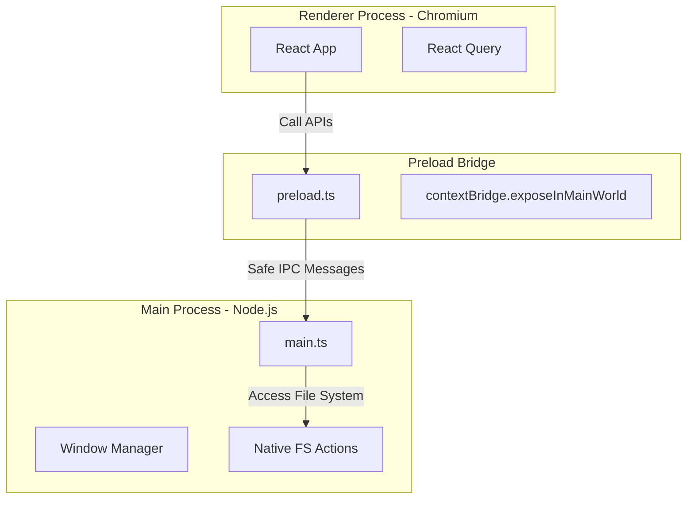
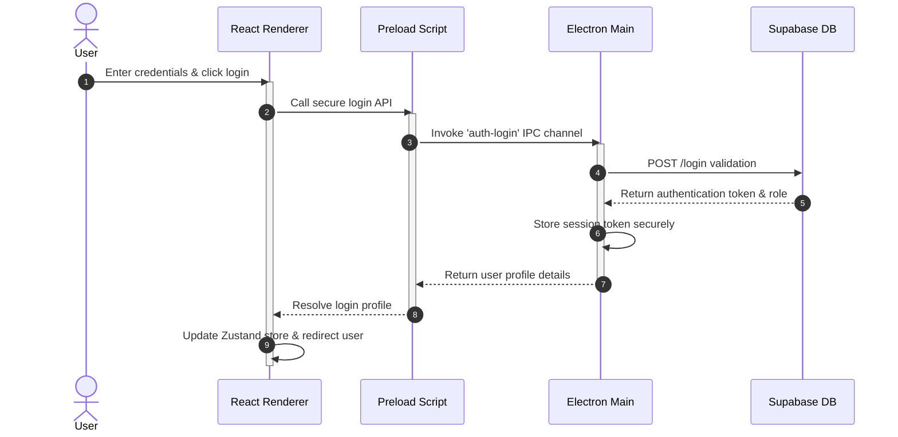

# LabCode — Frontend Architecture & Technical Specification (Phase 3.2)
## Electron + React + TypeScript + Tailwind CSS + Vite Project Architecture

---

## 1. Frontend Overview

### 1.1 Purpose & Responsibilities
The frontend layer is built as a desktop-native application hosted inside an **Electron** wrapper running a **React** application built with **TypeScript** and compiled using **Vite**. The frontend manages user portals, the code editor, and the compiler dashboard.

```
       +---------------------------------------------+
       |             Electron Container              |
       |  +---------------------------------------+  |
       |  |           Vite Core Engine            |  |
       |  |  +---------------------------------+  |  |
       |  |  |       React Presentation        |  |  |
       |  |  +---------------------------------+  |  |
       |  |  +---------------------------------+  |  |
       |  |  |     Zustand + React Query       |  |  |
       |  |  +---------------------------------+  |  |
       |  +---------------------------------------+  |
       +---------------------------------------------+
```

### 1.2 Architecture Goals & Guiding Principles
*   **Performance:** UI interactions must compile and respond under 100ms.
*   **Security:** Enforces IPC sanitization, Content Security Policies, and sandboxing.
*   **Type Safety:** Uses TypeScript to prevent runtime errors.
*   **Modularity:** Keeps feature modules separated to simplify updates.

---

## 2. Electron Architecture

The Electron container is divided into the **Main Process** and **Renderer Process**, separated by a **Preload Script** to keep the backend secure.



### 2.1 Process Separation and Communication
*   **Main Process (`main.ts`):** Creates the browser window, configures native security headers, manages application states, and handles file system tasks.
*   **Renderer Process (`renderer.ts`):** Runs the React application code within Chromium.
*   **Preload Script (`preload.ts`):** Acts as a secure gateway, exposing only specific API calls through the Electron `contextBridge`.
*   **IPC Communication:** Processes communicate using unidirectional calls (`ipcRenderer.send`) or bidirectional requests (`ipcRenderer.invoke`), preventing raw Node.js access in the Renderer process.

---

## 3. React Architecture

The React application uses a modular, component-based layout:

```
+-----------------------------------------------------------------------------+
|  Root App Wrapper (Main Entry, Global Context Providers, Themes)             |
+-----------------------------------------------------------------------------+
                                       |
                                       v
+-----------------------------------------------------------------------------+
|  Routing Guard Layer (Role Filters, Exam Lockouts, Heartbeat Checks)        |
+-----------------------------------------------------------------------------+
                                       |
                                       v
+-----------------------------------------------------------------------------+
|  Layout Systems (Split Workspace Shell, Center Forms Shell)                |
+-----------------------------------------------------------------------------+
                                       |
                                       v
+-----------------------------------------------------------------------------+
|  Feature Modules (Auth, Student, Faculty, Admin, Compilers, Reports)        |
+-----------------------------------------------------------------------------+
```

---

## 4. Project Folder Structure

The project uses the following directory structure:

```
labcode/
├── electron/                   # Electron Main process module files
│   ├── main.ts                 # Main Process entry point
│   └── preload.ts              # Preload secure context bridge script
├── src/                        # React Renderer frontend codebase
│   ├── assets/                 # Static branding files, logos
│   ├── components/             # Reusable UI component library (buttons, inputs)
│   ├── features/               # Feature-specific modules
│   │   ├── auth/               # Logins, user sessions, credentials
│   │   ├── student/            # Student home dashboard, exercise listings
│   │   ├── faculty/            # Seating grids, evaluations, sign-off files
│   │   └── admin/              # User directories, courses, maps
│   ├── hooks/                  # Global custom React hooks
│   ├── layouts/                # Base UI page wrappers (Split panels, grids)
│   ├── routes/                 # Navigation guards, role routing configurations
│   ├── services/               # API clients, axios configurations, data queries
│   ├── stores/                 # State management stores (Zustand, Query)
│   ├── types/                  # Global TypeScript type declaration files
│   ├── utils/                  # Shared helper functions
│   └── main.tsx                # React app entry point
├── package.json                # Project configurations
├── tsconfig.json               # TypeScript rules
└── vite.config.ts              # Vite bundle configurations
```

---

## 5. Feature Module Architecture

Each feature module is structured to keep concerns separated:

```
features/<module_name>/
├── components/                 # Module-specific component files
├── hooks/                      # Module-specific custom React hooks
├── pages/                      # Target screen layouts (e.g. login pages)
├── services/                   # Module-specific API client services
├── types.ts                    # Module TypeScript type interfaces
└── validation.ts               # Input validation validation rules
```

---

## 6. UI Component Architecture

UI elements are grouped into categories to promote code reuse:

*   **Common Components:** Basic UI building blocks (e.g., Buttons, Icons).
*   **Layout Components:** Page structures and resizable grid dividers.
*   **Form Components:** Standardized fields, textareas, and dropdown menus.
*   **Table Components:** Data tables featuring sorting, search, and pagination.
*   **Editor Components:** Programming editor views, line numbers, and consoles.

---

## 7. State Management

To keep state handling organized, the application uses **Zustand** for local state and **React Query** for server data caching:

```
+-----------------------------------------------------------------------------+
|                           STATE MANAGEMENT SYSTEM                           |
+-----------------------------------------------------------------------------+
|  Global App UI State (Zustand Stores)                                       |
|  - Theme parameters (Light/Dark)                                            |
|  - Active session authentication tags                                       |
|  - Screen split-pane layout dimensions                                      |
+-----------------------------------------------------------------------------+
|  Server Data State (React Query Cache)                                      |
|  - Mapped subject listings                                                  |
|  - Class seating status records                                             |
|  - Completed submission files                                               |
+-----------------------------------------------------------------------------+
```

### 7.1 State Categorization
*   **Global UI Store (Zustand):** Manages user session tokens, display themes, and editor pane dimensions.
*   **Server Cache (React Query):** Manages API query results, including student lists, grading parameters, and task instructions.
*   **Local Component State (`useState`):** Handles short-lived UI variables, such as dropdown toggle states and text inputs.

---

## 8. Routing & Access Strategy

The routing system uses **React Router** to manage user navigation and enforce security rules:

```
               [Request Path]
                     |
                     v
            [User Logged In?]
             /             \
          (No)             (Yes)
          /                   \
   [Redirect to Login]    [Role Verified?]
                           /             \
                        (No)             (Yes)
                        /                   \
                [Redirect Error]      [Render Dashboard]
```

*   **Public Route:** Accessible to all users (e.g., Login).
*   **Protected Student Route:** Restricts workspace access to students, checking heartbeat tokens.
*   **Protected Faculty Route:** Restricts class monitor views and grading tools to faculty.
*   **Protected Admin Route:** Restricts database configuration tools to system administrators.

---

## 9. API Communication Layer

*   **HTTP Client Wrapper (Axios):** Configures default headers, request timeouts (5 seconds), and base URLs.
*   **Request Interceptors:** Automatically adds authentication tokens to outgoing API request headers.
*   **Response Error Interceptors:** Catches validation failures and network drops, formatting them into clear error messages.
*   **Retry & Failover Strategy:** Automatically retries failed API requests up to 3 times under low-network conditions.

---

## 10. Authentication Flow



---

## 11. IPC Communication

To keep the application secure, Renderer requests are mapped to Node.js actions in the Main process:

| IPC Channel Name | Request Sender | Main Process Action | Success Behavior |
| :--- | :--- | :--- | :--- |
| **`auth:login`** | Renderer | Verifies login credentials and sets session tokens. | Returns user profile. |
| **`session:heartbeat`**| Renderer | Checks session status and updates connection logs. | Returns connection state.|
| **`file:save-draft`** | Renderer | Caches active code drafts to local storage. | Confirms file save. |
| **`pdf:compile`** | Renderer | Formats student records and generates PDFs. | Streams PDF output. |

---

## 12. File Management

*   **PDF Download Engine:** Employs `pdfkit` to compile student records, and triggers the browser's download manager to save the file directly to the user's Downloads directory.
*   **Signature Upload:** Allows faculty to upload PNG signature templates (under 2MB), converting them to Base64 strings to cache locally in the browser's storage.

---

## 13. Error Handling

*   **React Error Boundaries:** Wraps feature modules to catch UI errors, displaying a fallback recovery message: *"A dashboard component crashed. Click refresh to reload."*
*   **Global Exception Handlers:** Electron catch blocks capture unhandled Node.js exceptions and log them in log tracking tables.

---

## 14. Performance Strategy

*   **Code Splitting:** Uses dynamic imports (`React.lazy`) to load feature modules only when navigated to, reducing initial bundle size.
*   **Console Output Virtualization:** Employs windowed virtualization on the compilation console display to keep memory usage low during long runs.
*   **Autosave Debouncing:** Debounces text editor save inputs, triggering autosaves only after 1 second of user inactivity.

---

## 15. Frontend Security

*   **Context Isolation:** Enforces `contextIsolation: true` in the preload script to prevent the Renderer process from executing raw Node.js commands.
*   **Content Security Policy (CSP):** Restricts script loads, connect actions, and asset loading to verified application domains.
*   **XSS Protection:** Sanitizes text editor inputs to prevent malicious code injection.

---

## 16. Configuration Management

*   **Vite Env Variables:** Stores service URLs and public API keys in `.env` configuration files.
*   **Dev vs. Prod Configurations:**
    *   *Development:* Enables debugger logs, test endpoints, and hot reloading.
    *   *Production:* Disables console logs, minimizes JS bundles, and secures endpoint configurations.

---

## 17. Logging Specification

*   **Error Logging:** Logs system errors and compilation failures to database tracking tables.
*   **Debug Logs:** Logs warning flags and API transactions in development modes.
*   **User Action Logs:** Logs user actions (e.g., student submissions or grade saves) for audit compliance.

---

## 18. Testing Strategy

*   **Unit Tests:** Verifies individual helper functions and input validation rules.
*   **Component Tests:** Verifies layout component rendering, button states, and tab selections.
*   **Integration Tests:** Verifies communication flows between the React Renderer and the Electron Main process.
*   **Test Folders:** Places test files within a `__tests__` directory inside each feature module folder.

---

## 19. Coding Standards

*   **PascalCase Components:** All React component files must use PascalCase (e.g., `SidebarMenu.tsx`).
*   **camelCase Folders & Hooks:** Directory paths and custom hooks must use camelCase (e.g., `useAutosave.ts`).
*   **Strict Imports:** Excludes relative import paths, using absolute aliases (e.g., `@/components/Button`) to keep imports clean.

---

## 20. Developer Guidelines

### 20.1 Best Practices
*   **Follow Design Tokens:** Define spacing, border radii, and visual properties using designated Design System tokens.
*   **Verify Form Validation:** Form elements must run validation checks before allowing data to be submitted to database endpoints.
*   **Never Hardcode Text Labels:** Group all text displays in a translation file to simplify label updates.

### 20.2 Dos and Don'ts
*   **DO:** Keep feature modules self-contained to simplify updates.
*   **DO:** Display loading indicators within 200 milliseconds of triggering async API tasks.
*   **DON'T:** Do not allow the Renderer process to execute Node.js commands directly.
*   **DON'T:** Do not duplicate visual layouts; reuse common component designs.
