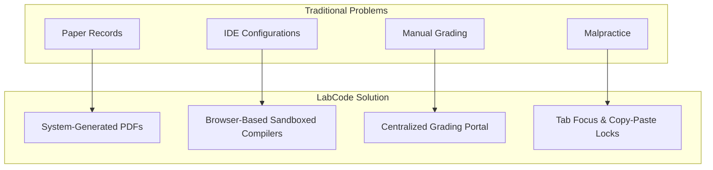

# LabCode — Product Requirement Analysis (PRA)
## Version 1.0 — Mangalore Institute of Technology & Engineering (MITE) Deployment

---

## 1. Project Introduction

### 1.1 Overview
In engineering institutions, programming laboratories are foundational to computer science and engineering curricula. However, the current operational model for managing these labs remains manual, fragmented, and paper-intensive. 

**LabCode** is a desktop-oriented, integrated digital **Programming Laboratory Management System** designed to replace the legacy physical lab workflow. It unifies the entire laboratory lifecycle—from task distribution and code compilation to real-time evaluation, proctoring, grading, and record signing—into a single digital ecosystem.

### 1.2 Problem Context
In traditional engineering laboratories, students write code in offline IDEs, copy code manually into physical observation books, obtain handwritten physical signatures from faculty, and later transcribe their work into final printed record sheets. Faculty must physically grade paper submissions, maintain separate spreadsheets for marks, and manually detect plagiarism. 

LabCode resolves these structural inefficiencies by providing an institutional workspace that runs in the browser, eliminating the need for local desktop configurations and physical paper trails, while providing administrative tracking of the laboratory's progress.

### 1.3 Target Stakeholders
LabCode is built specifically for:
*   **Students:** Who need an intuitive coding environment with instant compilation feedback and observation logging.
*   **Faculty:** Who require real-time class monitoring tools, digital grading interfaces, and automated report generation.
*   **College Administrators:** Who manage academic mappings, user registration, subject structures, and course audits.

---

## 2. Vision Statement
"To establish a unified, secure, and paperless laboratory workspace that empowers engineering institutions to transition from fragmented offline compiling environments to a transparent, real-time digital evaluation platform, fostering academic integrity and improving instructional efficiency."

---

## 3. Mission Statement
"To deploy a robust, zero-installation programming environment at MITE that eliminates manual paper record compilation, reduces faculty grading workloads, actively mitigates student code plagiarism, and guarantees administrative visibility into lab session progress through a secure desktop-optimized portal."

---

## 4. Project Goals

### 4.1 Short-Term Goals (Version 1.0 Deployment)
*   **Zero-Configuration Launch:** Deploy a browser-based, desktop-optimized system at MITE that eliminates the need for local compiler installations (GCC, Python, Java, etc.) on lab terminals.
*   **100% Digital Observation & Record System:** Replace physical observation books and printed record sheets with system-generated PDFs.
*   **Integrated Live Evaluator Workspace:** Enable faculty to grade code and add observations digitally within 60 seconds of a student's submission.
*   **Plagiarism & Cheating Reduction:** Enforce basic desktop proctoring via browser window focus tracking and paste restriction toggles.
*   **Single Device Session Control:** Implement hardware/browser session locking to prevent students from sharing accounts during evaluations.

### 4.2 Long-Term Goals (Future Iterations)
*   **System-Wide Institutional Adoption:** Expand from computer-related departments to general science and engineering laboratories.
*   **AI-Assisted Grading:** Integrate automated code analysis to evaluate syntax structure, time complexity, and grading suggestions.
*   **Multi-Institution Cloud Scaling:** Transition from a single-college local instance to a multi-tenant SaaS architecture.
*   **Adaptive EdTech Analytics:** Generate learning analytics reports showing student coding speeds, syntax error patterns, and syllabus blockers.

---

## 5. Problem Statement

The traditional programming laboratory workflow in engineering colleges is bottlenecked by the following factors:

| Problem Area | Detailed Description & Institutional Impact |
| :--- | :--- |
| **Manual Records & Waste** | Students spend significant time transcribing, printing, and pasting code into physical record books. This wastes time, incurs high paper printing costs, and yields physical files that are easily lost or damaged. |
| **Local IDE Dependency** | Maintaining uniform compiler and interpreter versions across hundreds of laboratory computer terminals is a major IT bottleneck. Terminals are frequently misconfigured, leading to student compilation errors during exams. |
| **High Faculty Workload** | Faculty must review physical codes, execute tests on student machines, manually write comments, grade paper records, and transcribe scores into Excel spreadsheets. This admin work distracts from teaching. |
| **No Centralized Grading** | Marks and qualitative evaluations are fragmented across loose sheets, individual notebooks, and personal spreadsheets. College administrators have no real-time way to audit syllabus completion or student performance. |
| **Code Plagiarism & Misuse** | Without copy-paste restrictions or tab monitoring, students copy code from USB drives, local files, or online sources, undermining the integrity of laboratory assessments. |
| **Poor Session Tracking** | Faculty cannot easily see who is actively coding, who has compile errors, or who is lagging behind. They must walk around the room to gauge the status of the lab session. |
| **Sign-Off Bottlenecks** | The requirement for handwritten signatures on physical observation sheets leads to long queues at the end of sessions, wasting valuable laboratory instructional time. |

---

## 6. Proposed Solution

LabCode addresses the institutional pain points described above through the following platform capabilities:



*   **Integrated Browser-Based Execution:** Students write, compile, and run code directly in their browsers. This bypasses terminal setups and ensures identical execution environments for all users.
*   **Digital Record Flow:** Student code, console outputs, and observations are logged automatically. At the end of the semester or session, the system generates unified laboratory records in PDF format.
*   **Real-Time Faculty Dashboard:** Faculty monitor student execution status, code drafts, and compile success rates in real-time from their own dashboard.
*   **Secured Assessment Controls:** Faculty can lock down the workspace by toggling fullscreen locks (proctoring mode) and clipboard paste blocks.
*   **Authenticated Digital Stamping:** Faculty upload signature templates to stamp evaluated records. This automates the grading and signature verification process.
*   **Centralized Database Registry:** All records, marks, and audit logs are recorded centrally, giving administrators access to course completion metrics and academic logs.

---

## 7. Version 1 Scope

### 7.1 Features Included in Version 1.0
*   **Single-Institution Design:** Configured exclusively for MITE. The branding (logo, department listings, course structures) is static.
*   **Three User Roles:** Student, Faculty, and College Administrator.
*   **Core Code Execution Sandbox:** Support for C, C++, Java, Python, JavaScript, and Web Frontend (HTML/CSS/JS with side-by-side preview).
*   **Split-Pane Editor Interface:** Resizable workspace featuring custom syntax highlighting and isolated dark/light code display theme variables.
*   **Manual Grading & Observations Console:** Fields for faculty to input numerical grades (0–10) and write feedback directly linked to code submissions.
*   **Proctoring Controls:** Remote toggling of clipboard paste restrictions and fullscreen application state checks.
*   **Digital Signature Stamping:** Faculty upload signature templates locally (Base64) to stamp single or bulk PDF exports.
*   **Student Double-Login Prevention:** System checks active logins to ensure a student is logged in on only one browser tab/device.
*   **Post-Exam Access Block:** Faculty can temporarily lock a student's login access after a test to prevent post-session code modifications.

### 7.2 Features Intentionally Excluded from Version 1.0
*   **Multi-Tenancy / Multi-College Support:** No multi-tenant partitions, university-level settings, or generic registration panels.
*   **Self-Registration:** Users cannot create accounts independently. All credentials must be created and uploaded by the Administrator.
*   **AI Auto-Evaluation:** No automated code scoring, logic reviews, or semantic grading.
*   **Offline Mode:** The system requires a live server connection; offline compiler execution is not supported.
*   **Version Control Integration (Git):** No native Git commits or remote repository sync.
*   **Mobile Support:** The editor and dashboard interfaces are strictly optimized for desktop resolutions (widths > 1024px) to reflect lab terminal constraints.

---

## 8. User Roles & Permissions

```
       +-----------------------------------------------------+
       |                  College Admin                      |
       |  - Add & edit users, subjects, faculty mappings    |
       |  - Audit grades & system log outputs                |
       +-----------------------------------------------------+
                                 |
                                 v
       +-----------------------------------------------------+
       |                     Faculty                         |
       |  - Manage tasks, toggle proctoring controls         |
       |  - Grade student code & observation logs            |
       |  - Digital signatures & bulk PDF exports            |
       +-----------------------------------------------------+
                                 |
                                 v
       +-----------------------------------------------------+
       |                     Student                         |
       |  - View task details & write solutions              |
       |  - Run test cases & write observation summaries     |
       |  - Download certified single lab records            |
       +-----------------------------------------------------+
```

### 8.1 Student Role
*   **Responsibilities:** Complete assigned programming exercises within scheduled lab hours, execute verification test cases, document observations, and generate certified reports.
*   **Permissions:**
    *   Read assigned tasks and associated documentation.
    *   Write and run code drafts inside the sandbox editor.
    *   Submit observations and code for evaluation.
    *   Download individual evaluated reports in PDF format.
*   **Limitations:**
    *   Cannot view other students' screens, codes, or grades.
    *   Cannot modify grades or comments entered by faculty.
    *   Cannot bypass proctoring controls (fullscreen/copy-paste restrictions) when enabled by faculty.
    *   Cannot log in on multiple devices concurrently.

### 8.2 Faculty Role
*   **Responsibilities:** Define course tasks, monitor student behavior, manage exam security settings, grade submissions, and sign off on completed lab records.
*   **Permissions:**
    *   Define, edit, and deactivate tasks for assigned subjects.
    *   Toggle fullscreen locks and paste restrictions for assigned classes.
    *   View real-time progress indicators (heartbeats, compile flags) for students in active sections.
    *   Enter grades (0–10) and write evaluation observations.
    *   Upload signature templates and export bulk/single signed PDFs.
    *   Force-logout students or temporarily block their logins.
*   **Limitations:**
    *   Cannot create user accounts or assign students to departments/sections.
    *   Cannot edit student source code drafts.
    *   Cannot view or manage subjects/classes assigned to other faculty.

### 8.3 College Administrator Role
*   **Responsibilities:** Maintain core database records, configure semesters/departments/sections, assign faculty mappings, and audit overall grading histories.
*   **Permissions:**
    *   Create, modify, and delete student, faculty, and administrator accounts.
    *   Create and manage departments, sections, and subjects.
    *   Map faculty members to specific subjects and sections.
    *   Audit system grades, raw compilation logs, and activity records.
*   **Limitations:**
    *   Cannot participate in coding sessions or run code inside student sandboxes.
    *   Cannot modify student source code or override grades entered by faculty.
    *   Cannot manage task lists or edit lab observation prompts.

---

## 9. User Journey

### 9.1 Student User Journey
1.  **Authentication:** The student enters their University Seat Number (USN) and password at the login screen. The system validates their credentials and verifies they do not have a double-login conflict or a faculty-imposed lockout.
2.  **Home Selection:** The student lands on their homepage, showing their profile details and assigned subjects. If a live examination mode is active for their section, a highlighted **LAB Exam** card is displayed.
3.  **Workspace Entry:** The student enters a lab workspace. The interface launches the desktop-split editor. If the subject has fullscreen mode enabled, the student is prompted to enter fullscreen.
4.  **Coding and Compilation:** The student reads the task description, selects their programming language, writes the code, and compiles it. The terminal console displays output or compiler errors.
5.  **Observation Documentation:** Once the output is correct, the student switches to the Observation tab to write their analysis.
6.  **Submission & Review:** The student saves their progress. They can review their grades and comments once faculty evaluations are complete.
7.  **Logout:** The student logs out, which clears the session lock on the server.

### 9.2 Faculty User Journey
1.  **Authentication:** The faculty logs in. The system loads their profile details and security signature configurations.
2.  **Subject Management:** The homepage displays assigned subjects. The faculty selects a subject and expands it to choose a target class section.
3.  **Security Setup:** The faculty opens the class control dashboard. They can pre-configure safety settings (Exam Mode, Fullscreen Lock, Paste Restrictions) before students enter.
4.  **Live Session Monitoring:** During the lab, the faculty monitors active student heartbeats, compile success rates, and code submissions in real-time.
5.  **Evaluation & Grading:** The faculty clicks on a student's card to review their code, output, and observations. They enter a grade, write observations, and save the score.
6.  **Signature Configuration:** The faculty uploads or verifies their PNG signature in the signature modal and enables document stamping.
7.  **Record Signing & Export:** The faculty generates a bulk PDF report for the entire class, stamped with their signature, or exports individual student records.
8.  **Post-Session Lockout:** If it was an exam, the faculty blocks student logins for that section to prevent code edits after the lab ends.

### 9.3 Administrator User Journey
1.  **Authentication:** The administrator logs in and lands directly on the Admin Dashboard.
2.  **System Audits:** The administrator reviews system stats (total users, active courses, pending tasks).
3.  **Academic Structure Configuration:** The admin sets up departments, academic years, cycles, and section divisions.
4.  **User Provisioning:** The admin uploads student rosters and registers faculty accounts.
5.  **Mapping Assignments:** The admin links faculty members to their respective subjects and sections.
6.  **Report Verification:** The admin reviews raw system logs and grading reports across sections for course auditing.
7.  **Logout:** The admin signs out.

---

## 10. Core Modules

```
+---------------------------------------------------------------------------------+
|                                  LABCODE PLAIN                                  |
+---------------------------------------------------------------------------------+
|   +------------------+    +-------------------+    +------------------------+   |
|   |  Authentication  |    | Student Dashboard |    |   Faculty Dashboard    |   |
|   +------------------+    +-------------------+    +------------------------+   |
|   +------------------+    +-------------------+    +------------------------+   |
|   | Admin Dashboard  |    |    Code Editor    |    |    Compiler Sandbox    |   |
|   +------------------+    +-------------------+    +------------------------+   |
|   +------------------+    +-------------------+    +------------------------+   |
|   |    Submission    |    |    Evaluation     |    |   PDF Report Engine    |   |
|   +------------------+    +-------------------+    +------------------------+   |
+---------------------------------------------------------------------------------+
```

### 10.1 Authentication & Session Management Module
Handles secure access validation, session state synchronization, and role checks.
*   Authenticates credentials against stored department/section roles.
*   Enforces login lockout timers (`login_blocked_until`).
*   Runs heartbeat checks to identify active sessions.
*   Implements single-session locks to prevent multiple logins under the same USN.

### 10.2 Student Dashboard Module
Provides students with access to their courses and tasks.
*   Displays student profile details (Name, USN, Section, Department).
*   Lists assigned laboratory subjects and active exam schedules.
*   Tracks syllabus progress via completion bars.

### 10.3 Faculty Dashboard Module
Serves as the main control center for managing lab sessions and grading.
*   Displays real-time lists of students in a class.
*   Features a live monitor showing student network statuses and compile indicators.
*   Provides security toggles for exam mode, fullscreen locks, and paste blocks.
*   Enforces post-session access locks.

### 10.4 Admin Dashboard Module
Provides tools to manage institutional structure and user accounts.
*   Interfaces to manage accounts (Students, Faculty, Admins).
*   Consoles to map departments, sections, cycles, and subjects.
*   Tools to link faculty members to sections and courses.
*   Access to raw system logs and grades for compliance checks.

### 10.5 Code Editor Module
A desktop-optimized code editing interface.
*   Split-pane layout with adjustable pane sizes.
*   Syntax highlighting support for C, C++, Java, Python, and JavaScript.
*   Isolated light and dark themes for the editor pane.
*   Tabbed interface to switch between the Editor, Problem Description, and Observation views.
*   Frontend preview panel with real-time rendering for HTML/CSS/JS tasks.

### 10.6 Compiler Sandbox Module
Manages code execution and output generation.
*   Sends code drafts to a sandboxed environment.
*   Supports standard inputs (`stdin`) for custom test cases.
*   Retrieves console outputs (stdout/stderr) and compile error details.
*   Tracks execution resource parameters.

### 10.7 Submission Module
Logs student programming progress.
*   Saves active code drafts when compilation runs.
*   Maintains a history of code revisions and compile logs.
*   Locks submissions once a student's session is marked complete or graded.

### 10.8 Evaluation & Feedback Module
Facilitates grading and feedback.
*   Displays a student's code alongside their console output and observations on a single screen.
*   Provides input fields for numerical grades (0–10).
*   Allows faculty to add qualitative comments.

### 10.9 PDF Report Engine Module
Generates certified laboratory records.
*   Compiles student details, codes, outputs, and observations into a single document.
*   Applies institution header templates (MITE logo, department details).
*   Renders faculty signature templates on graded programs.
*   Supports bulk exports to download a section's records as a single file.

---

## 11. Functional Requirements

### 11.1 Authentication & Security (FR-AUTH)
| ID | Title | Requirement Description | Priority |
| :--- | :--- | :--- | :--- |
| **FR-001** | Single Session Lock | The system must prevent a student account from establishing a concurrent active session. If a login request is received for an active USN, the system must check the user's heartbeat status. If the heartbeat is active (less than 40 seconds old), the new login request must be rejected. | High |
| **FR-002** | Login Lockout Timer | The system must allow faculty to block a student's login credentials. When blocked, the system must reject login attempts and show a countdown timer indicating when the lockout expires. | High |
| **FR-003** | Auto Session Timeout | If a user remains idle or doesn't execute code for 30 minutes, the system must log out the user and clear their session lock. | Medium |
| **FR-004** | Role-Based Access | The system must restrict dashboard access based on roles. Students must be redirected to `student-home.html`, faculty to `faculty-home.html`, and admins to `admin.html`. | High |

### 11.2 Student Workspace (FR-STUDENT)
| ID | Title | Requirement Description | Priority |
| :--- | :--- | :--- | :--- |
| **FR-005** | Tabbed Navigation | The student workspace must feature a tabbed interface with three views: Editor, Problem Description, and Observations. | High |
| **FR-006** | Custom Code Editor | The editor must support language selection (C, C++, Java, Python, JavaScript, and Web Frontend) with custom syntax highlighting. | High |
| **FR-007** | Custom Sandbox Inputs | Students must be able to specify custom `stdin` inputs to test their code. | Medium |
| **FR-008** | Observation Form | Students must have a rich text area in the Observations tab to write descriptions and document program results. | High |
| **FR-009** | Progress Metrics | The student workspace must display a progress bar showing completed programs relative to total assigned tasks. | Medium |

### 11.3 Faculty Control & Grading Workspace (FR-FACULTY)
| ID | Title | Requirement Description | Priority |
| :--- | :--- | :--- | :--- |
| **FR-010** | Live Status Monitor | The faculty dashboard must display active student connection statuses in real-time. Students who run compiler tasks must be shown with active indicators. | High |
| **FR-011** | Remote Security Switches | Faculty must have toggles to enforce fullscreen locks and block copy-pasting for assigned class sections. | High |
| **FR-012** | Task Creator | Faculty must be able to add new syllabus tasks by specifying program IDs, titles, description blocks, and sample inputs/outputs. | High |
| **FR-013** | Grading System | Faculty must be able to input grades (0–10 scale) and add comments directly within a student's submission view. | High |
| **FR-014** | Signature Upload | Faculty must be able to upload a PNG signature image, which is saved locally to stamp generated PDFs. | Medium |

### 11.4 PDF Report Generation (FR-PDF)
| ID | Title | Requirement Description | Priority |
| :--- | :--- | :--- | :--- |
| **FR-015** | Single PDF Export | The system must generate a PDF report for a student containing their profile details, assigned programs, source code, outputs, observations, grades, and the faculty's digital signature. | High |
| **FR-016** | Bulk PDF Compilation | The system must compile all student submissions for a selected section into a single, structured PDF file, sorted by USN and task ID. | High |
| **FR-017** | Custom Header Stamping | Exported PDFs must feature MITE branding, logo, and department name metadata on the cover sheet. | High |

### 11.5 Admin Panel (FR-ADMIN)
| ID | Title | Requirement Description | Priority |
| :--- | :--- | :--- | :--- |
| **FR-018** | User Management | Admins must be able to add, update, and delete accounts for students, faculty, and other administrators. | High |
| **FR-019** | Group Mapping | Admins must be able to create departments, sections, and subjects, and map faculty members to specific classes. | High |
| **FR-020** | Log Auditing | Admins must have access to a log viewer to audit system transactions and grading records. | Medium |

---

## 12. Non-Functional Requirements

### 12.1 Performance
*   **Compilation Response Time:** Code execution requests must return sandbox console outputs within 5 seconds under normal network conditions.
*   **Dashboard Sync Rate:** Faculty monitoring dashboards must update active student statuses and compile indicators within 3 seconds of execution events.
*   **PDF Generation Speed:** A single student PDF must compile and download within 4 seconds, and bulk class PDFs must generate within 15 seconds.

### 12.2 Security
*   **Code Sanitization:** Sandbox code execution must restrict file system reads, network connections, and shell access on execution servers.
*   **Local Signature Privacy:** Faculty signature templates must be stored securely on the client machine to prevent unauthorized database access.
*   **Proctoring Detection:** The system must detect when a user exits fullscreen mode or changes tabs, and immediately lock their workspace with a verification prompt.

### 12.3 Reliability & Availability
*   **Session State Persistence:** If a user experiences a temporary network drop (under 2 minutes), their code drafts and session status must remain cached to prevent data loss.
*   **Target Uptime:** The system must maintain 99.5% availability during scheduled laboratory hours.

### 12.4 Usability & Accessibility
*   **Desktop Optimization:** The interface layout must scale properly on laboratory monitors with screen widths of 1024px or higher.
*   **Isolated Display Themes:** The code editor must support dark and light theme options independent of the main dashboard UI to accommodate different lighting conditions in laboratory rooms.
*   **Responsive Layout:** Sidebar modules and code panes must support resizable borders for flexible viewing of code and problem descriptions.

---

## 13. Business Rules

*   **BR-1 (Assigned Tasks Only):** Students can compile and submit code only for tasks mapped to their assigned subjects and sections.
*   **BR-2 (Faculty Assignments):** Faculty members can only access class monitors, grade submissions, and export PDFs for subjects and sections mapped to their profiles by the administrator.
*   **BR-3 (Code Integrity):** Administrators can manage accounts and system mappings but are restricted from editing student code drafts or modifying grades entered by faculty.
*   **BR-4 (Grade Security):** Students are restricted from editing grading fields or overriding comments written by faculty.
*   **BR-5 (Unique Device Session):** A student can have only one active device session. Logging in from a new device must terminate any active session, provided the previous session's heartbeat has timed out.
*   **BR-6 (Exam Access Locks):** When a section is locked in Exam Mode, students can access only the designated exam tasks, and all default laboratory subjects are hidden.

---

## 14. Assumptions

*   **Desktop Interface Access:** It is assumed that students and faculty will access the system using desktop computers or laptops with a minimum screen resolution of 1024x768. Mobile compatibility is not required for Version 1.0.
*   **Continuous Local Network:** We assume MITE will maintain a stable local network connection during scheduled laboratory sessions to allow communication between client workstations and the system database.
*   **Browser Capabilities:** It is assumed that lab workstations use modern web browsers (Chrome, Edge, Firefox) that support standard APIs for fullscreen control, focus events, and storage.

---

## 15. Constraints

### 15.1 Technical Constraints
*   **Zero-Installation Client:** The student interface must run entirely within a standard web browser. No local browser extensions, compiler packages, or runtime files can be installed on lab terminals.
*   **No Multi-Tenancy:** Version 1.0 is built exclusively for MITE Course structures. It cannot support multiple college templates or separate school registrations.
*   **Sandbox Compiler Constraints:** Code execution resources (execution time limits, memory usage, file I/O) are constrained by sandbox API limits to prevent resource exhaustion.

### 15.2 Project Constraints
*   **Institutional Data Scope:** The database and system deployment must handle rosters only for students registered at MITE during the current academic cycle.

---

## 16. Risks

### 16.1 Technical Risks
*   **Compiler Service Interruptions:** The sandbox code compiler relies on external execution engines. If these services go offline, students will not be able to compile code during lab sessions.
    *   *Mitigation:* Keep a backup sandbox server ready and display clear connection status alerts to users.
*   **Browser Crash Data Loss:** Unsaved student code drafts could be lost if a browser tab crashes or updates during a session.
    *   *Mitigation:* Implement client-side auto-saving in the browser's storage to restore drafts if the page is reloaded.

### 16.2 Operational & Academic Risks
*   **Proctoring Limitations:** Tech-savvy students may find ways to bypass browser-based fullscreen checks (e.g., using virtual machines, dual monitors, or separate devices).
    *   *Mitigation:* Faculty must use physical room supervision alongside the digital monitoring dashboard to verify student activity.
*   **Signature Security Concerns:** Since faculty signatures are stored locally as Base64 images, there is a risk of unauthorized access or tampering if a workstation is left unlocked.
    *   *Mitigation:* Encrypt signature images in local storage and require a passcode before printing signatures on PDF files.

---

## 17. Success Criteria

*   **Zero IDE Setup Time:** 100% of student coding sessions are compiled inside the browser without local compiler installation.
*   **Paperless Records:** At least 95% of student evaluations and observations are completed and signed digitally.
*   **Reduced Grading Time:** Faculty grading times are reduced by 40% compared to physical record books and Excel spreadsheets.
*   **Stable Multi-Device Handling:** Zero instances of student double-login bypasses or session lock conflicts during evaluations.
*   **Administrative Oversight:** Admins can audit course progress and grade lists for any class section instantly.

---

## 18. Future Scope

The following features are excluded from Version 1.0 but identified for future planning:
*   **Multi-Tenant Deployment:** Update the platform to support multiple engineering colleges, complete with individual branding, independent databases, and a Super Admin role.
*   **Offline Sandboxed Compilers:** Package LabCode as a desktop application containing built-in local compilers, allowing it to run offline during network outages.
*   **AI Code Reviewer:** Add an AI assessment engine to analyze code complexity, evaluate logic paths, and suggest grades.
*   **Automatic Test Code Evaluator:** Add support for unit testing suites to automatically grade code based on pre-defined test cases.
*   **Real-time Activity Stream:** Create a visual dashboard displaying active coding, compilation success rates, and student performance metrics over time.

---

## 19. Weaknesses & Improvement Recommendations

During the requirements review, the following potential weaknesses were identified. We recommend addressing these improvements during the design phase:

### 19.1 Offline Compilation Vulnerability
*   **Weakness:** The current browser-only compiler requires an active internet connection. If the college's internet connection drops, the entire lab session is stalled.
*   **Recommendation:** Implement a service-worker caching mechanism that detects offline status and switches the editor to save drafts locally. Add a simple local compilation runner configuration for offline failover.

### 19.2 Signature Exposure
*   **Weakness:** Storing base64 PNG signatures directly in the browser's local storage presents a security risk, as users could extract the signature image from a shared workstation.
*   **Recommendation:** Protect signature templates with a short PIN. The signature image should be loaded into memory only during document compilation and cleared immediately afterward.

### 19.3 Single Administrator Bottleneck
*   **Weakness:** Requiring a single administrator to manage all accounts, departments, and course mappings for the entire college can lead to administrative delays.
*   **Recommendation:** Split the administrator role to include a Department-level role. This allows department heads to manage their own rosters, subjects, and assignments, reducing the workload on the main system administrator.
