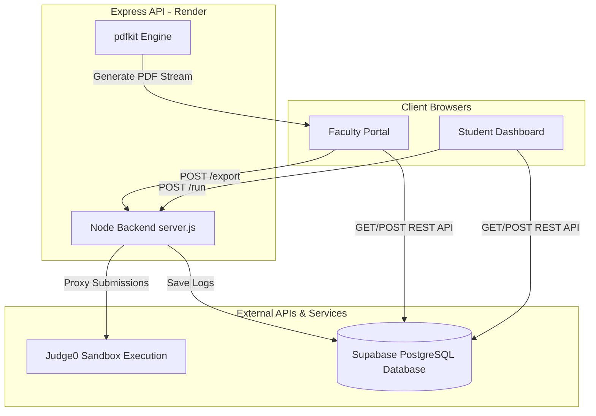

# LabCode - Project Overview, Architecture & Design Document (POD, SOD, SDD)

This document provides a comprehensive single-point-of-reference for **LabCode**, a full-stack educational and compiler platform designed for lab sessions and examinations. It covers the **Product Outline (POD)**, **System Outline (SOD)**, and **Software Design (SDD)** specifications.

---

## 📖 Part 1: Product Outline Document (POD)

### 1.1 Product Vision & Goals
In educational institutions (like MITE), managing laboratory sessions and programming exams historically relies on heavy local IDE configurations, manual observation books, and paper-based evaluations. This leads to slow setups, grading inconsistencies, and security/malpractice vulnerabilities.

**LabCode** solves this by providing a zero-installation, web-based environment where:
*   **Students** can read problem statements, code, run tests, and write observations directly inside their browsers.
*   **Faculty** can monitor student active statuses, view codes/outputs in real-time, assign marks, write comments, and export professional PDF lab records stamped with their signatures.

### 1.2 Target Audience & Roles
1.  **Students (Pupils):** Require a clean, responsive code editor, fast feedback loops (code run sandbox), clear problem descriptions, and a way to document observations.
2.  **Faculty (Evaluators):** Need a grading workspace to view the whole class, check student code, grade submissions, configure room/exam safety locks, and export signed PDFs.
3.  **Administrators/HODs:** Responsible for assigning subjects, mapping departments, and configuring student-to-section relationships.

### 1.3 Key Features & Value Proposition
*   **Zero-Config Compiler:** Runs code in sandboxed environments via Judge0.
*   **Isolated Theme Engine:** The editor theme is independent of the global web theme, ensuring developer comfort.
*   **Classroom Proctoring & Integrity:** Fullscreen enforcement and clipboard copy/paste locks, controlled remotely by faculty.
*   **Local Signature Printing:** Faculty sign documents digitally. Signatures are persisted securely on the client-side to bypass database schema limits.
*   **Bulk & Single PDF Generation:** Automated conversion of programming histories, observation statements, and grades into professional formatted records.

---

## 🏗️ Part 2: System Outline Document (SOD)

### 2.1 System Architecture
LabCode employs a decoupled, client-heavy full-stack architecture. 



### 2.2 Component Communications & Data Flow
1.  **Direct Database Access:** Client dashboards communicate directly with the **Supabase PostgreSQL REST API** using a secure public `anon` API key to retrieve user profiles, subjects, assigned tasks, and write comments.
2.  **Proxied Compiler Execution:** Students cannot execute code directly from their browsers to Judge0 because of API key confidentiality and submission logging. Instead, they hit the Express Backend `/run` endpoint, which proxies to Judge0 and logs the compilation stdout/stderr into the Supabase database.
3.  **Server-Side PDF Generation:** Express handles single and bulk PDF compilations via `pdfkit`, writing the PDF stream directly back to the client response headers to prompt a native download.

### 2.3 Deployment Architecture
*   **Frontend Environment:** Static HTML/CSS/JS files, lightweight footprint, zero library installations.
*   **Backend Server:** Hosted on Express.js on **Render** (Node.js environment).
*   **Database Service:** Relational PostgreSQL managed by **Supabase**.
*   **Sandbox Compiler:** **Judge0 Public Cloud API** handles short-lived executions for C, C++, Java, Python, and JavaScript.

### 2.4 Proctoring & Safety Locks
*   **Fullscreen Lock:** Checked client-side if `fullscreen_lock` is toggled in the subjects table. If the student exits fullscreen or shifts tabs, a overlay blocking model appears. Violating it multiple times is tracked.
*   **Clipboard Paste Blocker:** Overrides default paste events in textareas if `paste_enabled` is set to `false`. Displays a warning toast to discourage code plagiarism.
*   **Single-Session Lock (Device Double-Login Prevention):** When a student logs in, a unique session token `login_token` is generated and saved in `active_logins`. If another login request is received for the same USN, it evaluates a heartbeat. If the heartbeat is active (less than 40 seconds old), it blocks the new login, preventing students from sharing credentials or compiling on separate screens.

---

## ⚙️ Part 3: Software Design Document (SDD)

### 3.1 Frontend Component Designs
1.  **`login.html`:** Authenticates the user USN and password. Handles role checking (`student` vs. `faculty` or `admin`). Checks if a student is temporarily blocked (`login_blocked_until`).
2.  **`student-home.html`:** The student's dashboard. Shows basic user information (USN, Year, Section, Department) and maps active subject subjects. Also detects if there is an active exam scheduled for the user's section (`EXAM_STATE_${sectionId}`) to present the strict-mode examination card.
3.  **`index.html` (Student Editor):**
    *   **Resizable Split Pane:** Custom drag implementation using resize handles (`#sidebar-resize`).
    *   **Text Editor Overlay:** A transparent `textarea` layered directly over a stylized `<pre>` container (`#code-highlight`) that dynamically applies syntax highlighting classes to typed tokens.
    *   **Submissions & Heartbeats:** Fires a heartbeat to `/heartbeat` every 15 seconds. If the faculty deletes their session, the browser automatically kicks out the student.
4.  **`faculty-home.html`:** Allows faculty to view classes. Features a file upload modal that converts a signature PNG to a Base64 string and caches it locally (`localStorage.setItem('labcode_signature_image', sigBase64)`).
5.  **`dashboard.html` (Faculty Control Panel):**
    *   **Student Seating Panel:** Shows student names, USNs, and their progress indicators. Active compiler heartbeats are displayed with green badges.
    *   **Grade Form:** Inline forms to submit marks (0 to 10 scale) and type qualitative feedback.
    *   **Safety Control Toggles:** Quick switches to toggle Exam Mode, Proctoring Fullscreen, and Paste restrictions for the current class.

### 3.2 Database Schema (Supabase PostgreSQL)

```
                       +-------------------+
                       |    departments    |
                       +-------------------+
                       | id (PK, int)      |
                       | code (varchar)    |
                       | name (varchar)    |
                       +-------------------+
                                 |
                                 | (1:N)
                                 v
+------------------+   +-------------------+   +--------------------+
|     sections     |   |       users       |   |      subjects      |
+------------------+   +-------------------+   +--------------------+
| id (PK, int)     |---| usn (PK, varchar) |   | id (PK, int)       |
| year (int)       |   | password (varchar)|   | code (varchar)     |
| section_name(vch)|   | name (varchar)    |   | name (varchar)     |
| cycle (varchar)  |   | role (varchar)    |   | year (int)         |
+------------------+   | dept_id (FK, int) |   | language (varchar) |
         |             | blocked_until(tst)|   | paste_enabled (bool|
         |             +-------------------+   | fs_lock (bool)     |
         |                       |             +--------------------+
         | (1:N)                 | (1:N)                 |
         |                       |                       |
         v                       v                       | (1:N)
+--------------------------------------------------+     |
|                 faculty_subjects                 |     |
+--------------------------------------------------+     |
| id (PK, int)                                     |     |
| faculty_usn (FK -> users.usn)                    |     |
| subject_id (FK -> subjects.id)                   |     |
| section_id (FK -> sections.id)                   |     |
+--------------------------------------------------+     |
                                                         v
+------------------+   +-------------------+   +--------------------+
|  active_logins   |   |       tasks       |   |    submissions     |
+------------------+   +-------------------+   +--------------------+
| usn (PK/FK, vch) |   | id (PK, int)      |   | id (PK, serial)    |
| login_token (vch)|   | program (varchar) |   | usn (FK -> users)  |
| last_seen (tst)  |   | title (varchar)   |   | program (varchar)  |
+------------------+   | description (txt) |   | language (varchar) |
                       | input (text)      |   | code (text)        |
                       | output (text)     |   | output (text)      |
                       | subject_id (FK)   |   | status (varchar)   |
                       | is_active (bool)  |   | marks (int)        |
                       +-------------------+   | observation (text) |
                                               | subject_id (FK)    |
                                               | submitted_at (tst) |
                                               +--------------------+
```

### 3.3 Express API Endpoint Specifications

#### 1. Session & Access Control APIs
*   **`POST /login`**
    *   **Body:** `{ usn, password }`
    *   **Process:** Checks credentials inside `users` table. Validates `login_blocked_until` date. If it's a student, verifies that their USN is not active in `active_logins` (checking if heartbeat > 40 seconds ago). Inserts a random session token if allowed.
    *   **Response:** `{ success: true, name, role, usn, login_token }` or `{ success: false, message }`
*   **`POST /heartbeat`**
    *   **Body:** `{ usn, login_token }`
    *   **Process:** Checks if session is valid and updates `last_seen` timestamp to current time. Re-checks if user's account has been blocked since logging in.
    *   **Response:** `{ success: true }` or `{ success: false, kicked: true, blocked: true }`
*   **`POST /session-logout`**
    *   **Body:** `{ usn }`
    *   **Process:** Deletes active record matching student USN from `active_logins` database table.
    *   **Response:** `{ success: true }`
*   **`POST /force-logout/:usn`**
    *   **Access:** Faculty only
    *   **Process:** Removes session for USN to free the user from session locking.
*   **`POST /block-login/:usn`**
    *   **Access:** Faculty only
    *   **Body:** `{ minutes }`
    *   **Process:** Updates `login_blocked_until` inside `users` table. Kills any active logins immediately.
*   **`POST /unblock-login/:usn`**
    *   **Access:** Faculty only
    *   **Process:** Sets `login_blocked_until` to `null`.

#### 2. Compiler Sandboxing APIs
*   **`POST /run`**
    *   **Body:** `{ code, language_id, usn, program, language, stdin, subject_id }`
    *   **Process:** Proxies source code execution to Judge0 cloud system (`https://ce.judge0.com/submissions?wait=true`). Logs execution codes, stdout/stderr status, and timestamps directly into `submissions` database table.
    *   **Response:** `{ output, status }`

#### 3. Grade & Marking APIs
*   **`POST /marks`**
    *   **Body:** `{ id, marks }`
    *   **Process:** Patches the `submissions` table to assign marks to a specific submission ID.
*   **`POST /observation`**
    *   **Body:** `{ id, observation }`
    *   **Process:** Patches the observation field in the `submissions` table.

#### 4. Document Compilation & PDF Export APIs
*   **`POST /export/:usn` (or `GET`)**
    *   **Query Params:** `subject_id`, `subject`
    *   **Body:** `{ signature_image: "base64...", signature_enabled: true/false }`
    *   **Process:** Compiles latest submissions per program for the student. Formats a cover page displaying MITE branding logo, student metadata details, and applies the faculty signature image dynamically using `pdfkit`. Flow-aligns student codes, logs, outputs, and observations across separate pages.
    *   **Response:** PDF stream.
*   **`POST /export-subject/:subjectId` (or `GET`)**
    *   **Query Params:** `subject`
    *   **Body:** `{ signature_image: "base64...", signature_enabled: true/false }`
    *   **Process:** Pulls all students' submissions assigned to the subject ID. Compiles a multi-student bulk PDF index document stamped with the faculty signature.
    *   **Response:** PDF stream containing full class reports.

### 3.4 Logic Workflows

#### Active Logins / Single-Session Heartbeat Loop
```
   Student Logs In
        |
        v
 Is USN in active_logins?
   /         \
 (No)        (Yes)
  /            \
Create Token  Is last_seen < 40 seconds ago?
  |            /         \
  v          (No)        (Yes)
Allow Login   /            \
             /           Reject Login:
       Delete Old Session "Already logged in"
             |
             v
       Create Token & Allow
```

#### Custom Editor Syntax Highlighter Implementation
Because vanilla HTML textareas do not support styled HTML elements directly, LabCode uses a layered visual display trick:
1.  **Backdrop Layer (`.code-highlight`):** A read-only `<pre>` block styled with colors representing syntax categories (keyword, string, comment, number, function).
2.  **Input Layer (`.code-editor`):** A standard `<textarea>` element placed directly on top of the `<pre>` container. The text color is styled as `transparent` (invisible) but the cursor caret color is set to custom accent orange.
3.  **Synchronization Mechanism:** Whenever the user types inside the textarea, a JavaScript event triggers:
    *   It copies the raw value of the textarea to the backend text holder.
    *   Fires a regex parsing rules function to substitute characters with formatted text (e.g., matching `"string"` to `<span class="tok-string">"string"</span>`).
    *   Updates the `.code-highlight` innerHTML.
    *   Ensures scroll position matches by setting `codeHighlight.scrollTop = codeEditor.scrollTop`.
