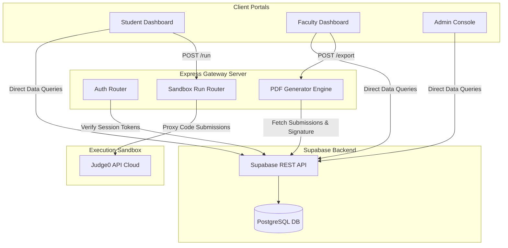
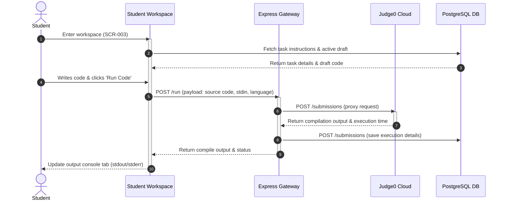

# LabCode — Solution Architecture Document (SAD)
## Enterprise System Architecture & Technical Blueprint — MITE Institutional Deployment

---

## 1. Executive Summary

This document defines the high-level **Solution Architecture** for **LabCode Version 1.0**, a programming laboratory management platform designed for engineering college laboratory environments. The platform integrates code execution sandboxes, real-time activity monitors, digital grading systems, and authenticated PDF report generators into a secure, desktop-first workspace.

Version 1.0 is optimized for a single-institution deployment at MITE. The architecture focuses on performance, reliability under varying network conditions, and security during timed exams. It is designed to scale from a single department to university-wide courses without structural rewrites, providing a path toward multi-tenant SaaS scaling in future versions.

---

## 2. Architecture Goals

The architecture of LabCode is designed to achieve the following institutional objectives:

*   **Low Client Latency:** Compilation executions and sandbox output returns must complete in under 5 seconds under standard network loads.
*   **Zero-Installation Footprint:** All student and faculty functions must run within standard web browsers without requiring local compiler runtimes or browser extensions on lab terminals.
*   **Real-Time Dashboards:** Faculty class seating grids must display student status changes and compile indicators within 3 seconds of execution events.
*   **High Data Reliability:** Unsaved student code drafts must be cached locally to prevent data loss during network disruptions.
*   **Proctoring and Exam Integrity:** Enforce strict controls (fullscreen locks, paste blocks, single-session checks) that block execution when violations are detected.

---

## 3. Architecture Principles

The system architecture is guided by these five core design principles:

```
+-----------------------------------------------------------------------------------+
|                           FIVE SYSTEM DESIGN PRINCIPLES                           |
+-----------------------------------------------------------------------------------+
|  1. Separation of Concerns             |  4. Fail-Safe Client Caching              |
|  2. Stateless Server Routing           |  5. Secure Client-Side Cryptography       |
|  3. Loose API Component Coupling        |                                           |
+-----------------------------------------------------------------------------------+
```

1.  **Separation of Concerns:** Keep frontend layout elements, Express route proxies, and database storage modules separated to simplify updates.
2.  **Stateless Server Routing:** Design API routes to be stateless, passing session authentication tags in request headers to allow for easy scaling.
3.  **Loose API Component Coupling:** Connect external sandboxes and database endpoints through standard APIs to allow components to be updated independently.
4.  **Fail-Safe Client Caching:** Implement local caching in the browser to ensure the student's coding workspace remains functional during temporary network disconnections.
5.  **Secure Client-Side Cryptography:** Keep sensitive data, such as faculty signature files, secure on the client side, sending them only in encrypted payloads during PDF generation.

---

## 4. Overall System Architecture

LabCode uses a decoupled client-server architecture. The frontend web portals connect to the Express backend and the Supabase database.



---

## 5. Layered Architecture

The system is organized into four logical layers to keep dependencies clean:

```
+-----------------------------------------------------------------------------+
|  Presentation Layer (Vanilla HTML5 / CSS3 / ES6 Javascript Portal Apps)     |
+-----------------------------------------------------------------------------+
                                       |
                                       v
+-----------------------------------------------------------------------------+
|  Application Services Layer (Express Gateway, pdfkit, Session heartbeat)    |
+-----------------------------------------------------------------------------+
                                       |
                                       v
+-----------------------------------------------------------------------------+
|  Integration & Security Layer (Supabase REST APIs, CORS, SSL Validation)    |
+-----------------------------------------------------------------------------+
                                       |
                                       v
+-----------------------------------------------------------------------------+
|  Data Infrastructure Layer (PostgreSQL DB, Row Level Security Models)       |
+-----------------------------------------------------------------------------+
```

### 5.1 Layer Descriptions
*   **Presentation Layer:** Browser-based client portals (Student, Faculty, Admin) that manage user inputs, code editing, dashboards, and client-side validation.
*   **Application Services Layer:** An Express server that proxies compilation requests, manages session heartbeats, and generates PDF reports.
*   **Integration Layer:** Supabase APIs that manage direct data queries from the client portals, securing access with SSL and validation tokens.
*   **Data Infrastructure Layer:** PostgreSQL database that stores user profiles, syllabus tasks, grades, and academic mapping records.

---

## 6. Module Architecture

The backend gateway is built using modular components to isolate distinct functions:

```
                     +---------------------------------------+
                     |         Express Router Gateway        |
                     +---------------------------------------+
                               /         |         \
                              /          |          \
                             v           v           v
            +------------------+ +------------------+ +--------------------+
            |   Auth Module    | |  Sandbox Module  | | PDF Export Engine  |
            +------------------+ +------------------+ +--------------------+
            | Verify logins    | | Proxy code runs  | | Compile records  |
            | Manage session   | | Format inputs    | | Stamp signatures |
            | Check timeouts   | | Log executions   | | Stream downloads |
            +------------------+ +------------------+ +--------------------+
```

---

## 7. Module Responsibilities

### 7.1 Client Modules
*   **Editor Panel:** Manages code inputs, line numbering, syntax highlighting, and local draft autosaves.
*   **Dashboard Grid:** Displays active subjects, student progress bars, and class seating indicators.
*   **Settings Controller:** Manages user configuration parameters and local storage for faculty signatures.

### 7.2 Backend Services
*   **Auth Module:** Verifies credentials, runs double-login checks, updates heartbeats, and manages account lockouts.
*   **Sandbox Module:** Formats source code payloads, forwards executions to the compiler sandbox, and saves outputs.
*   **PDF Export Engine:** Compiles submission records, formats cover pages with MITE branding, and stamps faculty signatures on generated documents.

---

## 8. Communication Flow



---

## 9. Request/Response Lifecycle

```
[Client Trigger] 
      |
      v
[CORS & Header Validation]
      |
      v
[Token Validation]
      |
      v
[Express Route Processor] ---------> [External Sandbox Proxy]
      |                                      |
      v                                      v
[Database Logger] <------------------ [Compile Output Return]
      |
      v
[JSON Response Return]
```

1.  **Client Request:** The client portal sends an HTTP request containing authorization tokens and data payloads.
2.  **Gateway Check:** The Express gateway validates headers and verifies security tokens.
3.  **Route Processing:** The router processes the request, routing compile tasks to the sandbox or database queries to Supabase.
4.  **Sandbox Proxy:** Compile runs proxy requests to the sandbox, returning execution results back to the router.
5.  **Logging:** Execution records are saved directly to the database.
6.  **Response Return:** The router formats results into a JSON payload and returns it to the client portal.

---

## 10. User Interaction Flows

### 10.1 Student Workspace Interaction Flow
*   **Trigger:** Keystroke input inside the code editor textarea.
*   **System Response:** Updates syntax highlighting, increments character counts, and resets the 30-second autosave timer.
*   **Success Behavior:** Displays *Draft Saved* in the header. The code draft is cached locally in the browser's storage and synced to the database.

### 10.2 Faculty Seating Monitor Flow
*   **Trigger:** Click on the class section card.
*   **System Action:** Starts real-time status queries, fetching student connection health and compile status updates.
*   **Success Behavior:** The dashboard updates connection badges and compile markers every 3 seconds.

---

## 11. External Services Mappings

*   **Database Infrastructure:** **Supabase PostgreSQL Engine** (`https://brjugcqaznpgvfbcpnxl.supabase.co`).
*   **Sandbox Compiler Engine:** **Judge0 Public Cloud APIs** (`https://ce.judge0.com`).
*   **Report Template Engine:** **pdfkit Server Module** handles server-side document layout rendering and formatting.

---

## 12. Data Flow Architecture

```
Student Code Input
       |
       v
Local Storage Draft Cache
       |
       v
POST /run Payload ---> Express Sandbox Proxy ---> Judge0 Compilation Run
       |                                                    |
       v                                                    v
DB Submissions Update <------------------------------ Return Execution Logs
       |
       v
PDF Generation Module ---> Stamp Faculty Signatures ---> Stream Signed PDF Record
```

*   **Draft Pipeline:** Code changes cache in browser storage before syncing to the database during compile runs.
*   **Execution Logs:** Compiler console outputs (stdout/stderr) save directly to submission tables.
*   **PDF Generation Pipeline:** Merges user profiles, graded submissions, and signature templates into signed PDF records.

---

## 13. Dependency Map

```
                     +---------------------------------------+
                     |             Express Gateway           |
                     +---------------------------------------+
                               /                   \
                              /                     \
                             v                       v
            +------------------+           +--------------------+
            |      axios       |           |       pdfkit       |
            +------------------+           +--------------------+
            | Proxy REST runs  |           | Render PDF layouts |
            | Database syncs   |           | Stamp signatures   |
            +------------------+           +--------------------+
```

---

## 14. Non-Functional Architecture

*   **Security:** Enforces single-device logins, proctoring locks, account timeouts, and rate limits.
*   **Availability:** Employs backup connection configurations to ensure 99.5% system availability during scheduled lab sessions.
*   **Usability:** Minimal interface design with split-pane code editors, optimized for screen widths of 1024px or higher.

---

## 15. Performance Strategy

*   **Execution Caching:** Caches static task descriptions and course templates in browser storage to reduce database reads.
*   **Asynchronous Processing:** Runs sandbox compilation tasks asynchronously, keeping the student's editor responsive.
*   **Incremental PDF Generation:** Compiles bulk PDF records in batches of 10 to manage server memory usage.

---

## 16. Security Strategy

*   **Encrypted Signature Payload:** Faculty signature images are stored locally in the browser and sent in encrypted payloads only when generating PDFs.
*   **Proctoring Detection:** Detects exits from fullscreen mode, instantly locking the editor and alerting the faculty monitor.
*   **Code Sanitization:** Sandbox compilation runs restrict code access to the server's file system, network, and command shell.

---

## 17. Reliability Strategy

*   **Offline Draft Mode:** If the connection drops, the system caches student drafts locally, syncing them back to the database once connection is restored.
*   **Failed Sandbox Recovery:** If compiler sandbox latency exceeds 8 seconds, the system cancels the run and displays a timeout error in the console.

---

## 18. Scalability Strategy

*   **Decoupled Modules:** The frontend interface, Express gateway, and database remain separate. This allows components to be updated or scaled independently.
*   **State-Free APIs:** API routes remain stateless, passing authentication tokens in request headers to simplify database interactions.

---

## 19. Logging Strategy

```
[API Request Received]
        |
        v
Save transaction details to log registry
(Timestamp, User ID, Route, Action)
        |
        v
Update performance metrics
(Sandbox execution time, compile status)
```

*   **Activity Logs:** Logs administrative tasks, grading changes, and login attempts in database tracking tables.
*   **Compile Statistics:** Logs compile success rates, compiler error codes, and execution times.

---

## 20. Error Handling Strategy

*   **Validation Errors:** Forms validate user inputs immediately on focus loss, highlighting incorrect fields in red.
*   **Database Downtime:** If the database is unreachable, the system displays a connection error page and caches active editor drafts locally.
*   **Session Expiry:** Expired sessions automatically redirect users to the login screen, clearing session tokens from the database.

---

## 21. Deployment Overview

*   **Frontend Portals:** Static files hosted on institutional web servers or deployed via CDN networks.
*   **Express Services:** Express gateway instances deployed to scalable container hosts (e.g., Render Web Services).
*   **Database Infrastructure:** Relational database tables hosted on Supabase Cloud.

---

## 22. Architectural Risks & Mitigations

*   **Compiler Sandbox Downtime:** External compiler services may experience outages during lab sessions.
    *   *Mitigation:* Keep a backup sandbox service configured to handle compilations if the primary server goes offline.
*   **Workstation Draft Loss:** Local drafts could be lost if a browser crashes or is closed unexpectedly.
    *   *Mitigation:* Auto-save active code drafts in browser storage every 30 seconds.
*   **PDF Generation Timeouts:** Compiling signed records for large classes can cause server timeout errors.
    *   *Mitigation:* Generate PDFs in batches of 10 and merge the files on the server to prevent timeouts.

---

## 23. Architecture Decisions

*   **Vanilla JS Portals:** Using standard HTML/CSS/JS for the client portals ensures fast load times on older lab terminals.
*   **Express Proxy Server:** The Express server acts as a secure gateway, proxying compiler tasks and managing PDF generation safely.
*   **Supabase PostgreSQL:** Supabase manages data storage with relational database tables, securing access using validation tokens.

---

## 24. Design Trade-offs

*   **Client-side Signature Storage:** Storing faculty signature templates locally in browser storage keeps signatures secure but requires faculty to re-upload files if they switch computers.
*   **Stateless Backend Gateway:** Using stateless API routes reduces server workload but increases database validation calls.

---

## 25. Future Expansion Strategy

*   **Multi-Institution SaaS:** The data schema includes institutional identifiers, making it easy to partition databases for multi-college deployments.
*   **AI Auto-Evaluation:** The database submissions table includes rating fields to support future auto-grading tools.
*   **Offline compilation:** The compiler module is decoupled from the main interface, allowing it to connect to a local desktop compiler runner in future updates.
